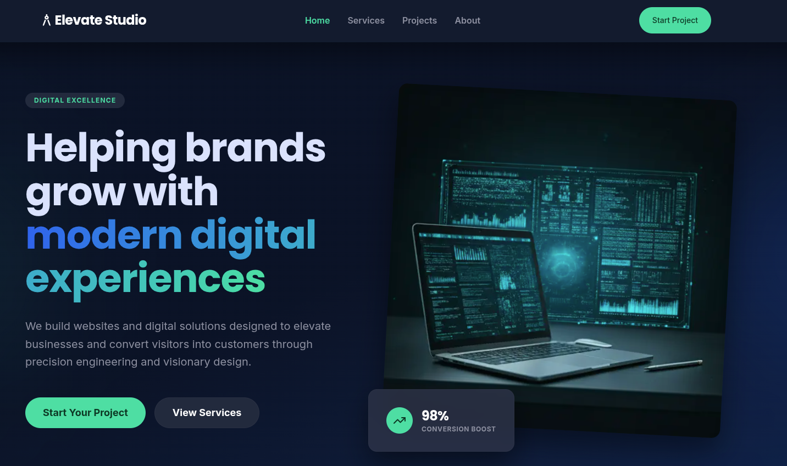

# Elevate Studio

> Modern Digital Agency Website built with Next.js, TypeScript, Tailwind CSS, MongoDB, and Zod.



## 🚀 Overview

Elevate Studio is a modern agency website designed to help businesses establish a professional online presence and convert visitors into clients.

The project focuses on:

* Modern UI/UX
* Responsive Design
* High Performance
* Contact Form with Validation
* Admin Dashboard for Messages
* MongoDB Integration
* SEO-Friendly Architecture

---

## ✨ Features

### 🌐 Website Pages

* Home
* About
* Services
* Projects
* Contact

### 📩 Contact System

Visitors can:

* Submit inquiries through the contact form
* Receive instant validation feedback
* Send project details directly

Built using:

* React Hook Form
* Zod Validation
* MongoDB

---

### 🔒 Admin Dashboard

Admin can:

* View all contact messages
* Read inquiries
* Manage leads

Dashboard Features:

* Protected Admin Area
* Message Management
* Lead Tracking

---

### 📱 Fully Responsive

Optimized for:

* Desktop
* Tablet
* Mobile Devices

---

### ⚡ Performance Optimized

* Next.js App Router
* Server Components
* Optimized Images
* Fast Loading Pages

---

## 🛠 Tech Stack

### Frontend

* Next.js 15
* React
* TypeScript
* Tailwind CSS
* Framer Motion

### Backend

* Next.js API Routes
* MongoDB
* Mongoose
* Zod

### Deployment

* Vercel

---

## 📂 Project Structure

```bash
src/
│
├── app/
│   ├── about/
│   ├── services/
│   ├── projects/
│   ├── contact/
│   ├── admin/
│   └── api/
│
├── components/
│
├── lib/
│   ├── mongodb.ts
│   └── validations/
│
├── models/
│   └── Contact.ts
│
├── hooks/
│
└── types/
```

---

## ⚙️ Environment Variables

Create a `.env.local` file:

```env
MONGODB_URI=your_mongodb_connection_string

```

---

## 🚀 Getting Started

Install dependencies:

```bash
npm install
```

Run development server:

```bash
npm run dev
```

Build production version:

```bash
npm run build
```

Start production server:

```bash
npm start
```

---

## 🚀 Live Demo

👉 [View Live Project](https://gstack-ashen.vercel.app)

---

## 📈 Business Goal

The purpose of Elevate Studio is to demonstrate a real-world digital agency website capable of:

* Generating leads
* Showcasing services
* Displaying projects
* Managing client inquiries

---

## 🎯 Future Improvements

* Blog System
* CMS Integration
* Testimonials Management
* Project Filtering
* Analytics Dashboard
* Email Notifications
* Multi-language Support

---

## 👨‍💻 Author

**George Shenoda**

Founder of **G-Stack**

> From Code to Complete Solutions

### Connect

* Portfolio: [https://gstack-ashen.vercel.app](https://gstack-ashen.vercel.app)
* GitHub: [https://github.com/gstack-dev](https://github.com/gstack-dev)
* LinkedIn: [https://www.linkedin.com/in/g-stack/](https://www.linkedin.com/in/g-stack/)

---

## 📄 License

This project is available for educational and portfolio purposes.
